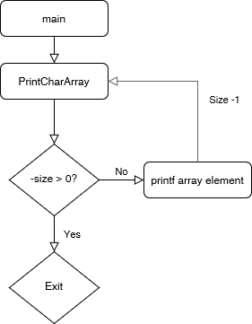
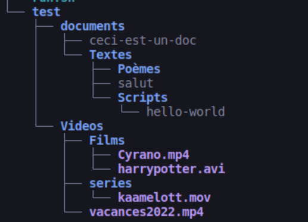
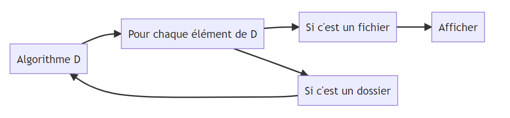

---
title: "IR209 - Développement"
subtitle: "Rapport de Laboratoire 2: Fonctions itératives vs fonctions récursives"
author: [Maljean Thimothé, Tasiaux Victor]
date: "05-10-2022"
geometry: "left=2.5cm,right=2.5cm,top=2cm,bottom=2cm"
pdf_document: null
titlepage: true
book: false
toc-own-page: true
toc-title: "Table des Matières"
lof-title: "Table des Figures"
lof: false
toc: true

...


# Exercice 1
## Version 1 : Avec variable d'accumulation
```C
#include <stdio.h>
void printCharArray(char arr[], int size, int i){

    if (i < size){
        printf("%c ",arr[i]);
        printCharArray(arr,4,i+1);
    }
}


int main(void){
    char arr[] = {'A','B','C','D'};
    printCharArray(arr,4,0);

    return 0;
}
```
Pour se débarasser du for, la fonction doit s'appeler elle-même. A cette fin, le `if` est ce qui permet de vérifier quand arrêter d'appeler la fonction récursive.
## Version 2: Sans variable d'accumulation
```C
#include <stdio.h>


void printCharArray(char arr[], int size){
    

    if (-size < 0){
        
        printCharArray(arr,size-1);

        printf("%c ",arr[size-1]);
    }
}


int main(void){
    char arr[] = {'A','B','C','D'};
    printCharArray(arr,4);

    return 0;
}
```
Pour se débarrasser de la variable d'accumulation, on peut utiliser la variable `size`, qu'on décrémente, ainsi l'utilise comme "compteur" et on a plus besoin de variable `i`. Si on mettait `printCharArray` en fonction suffixe, on listerait le directory en sens inverse. Il faut mettre la fonction `printCharArray` avant le `printf`, donc en fonction préfixe.



# Exercice 2

## Arborescence
On a créé cette arborescence de test.



## Algorithme




## Code

```C
#include <dirent.h>
#include <stdlib.h>
#include <stdio.h>
#include <string.h>


void dirContent(const char rootpath);


int main(void){

    dirContent("/home/kali/Documents/Developpement/Lab2/exercice2/test");

    return 0;
}

void dirContent(const charrootpath){
    puts(rootpath);
    DIR d = opendir(rootpath);
    struct direntsd = readdir(d);

    while (sd != NULL){

        if(sd -> d_type == DT_DIR){
            char rp,newPath;
            rp = malloc(sizeof (char) * BUFSIZ);
            newPath = malloc(sizeof (char) * BUFSIZ);
            strcpy(rp,d);
            strcpy(newPath,sd->d_name);
            strcat(newPath,d);
            dirContent(newPath);
        }

        else{
            if(sd -> d_type == DT_REG){
                printf("Nom du fichier: %s",sd->d_name);
            }
        }

    }


}
```
A l'heure actuelle, ce code n'est pas fonctionnel.